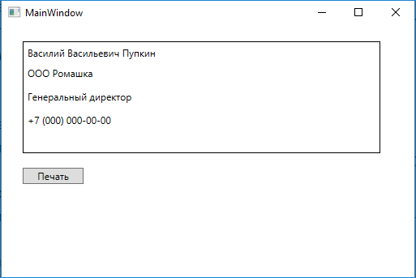
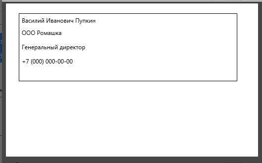

# Генерация и выгрузка отчётов в PDF C# wpf
WPF поддерживает вывод элементов XAML на печать в том виде, в котором они отображаются в работающей программе.

Рассмотрим следующий пример. Допустим есть окно, в котором отображается макет визитной карточки и эту карточку требуется распечатать.

Внешний вид окна показан на скриншоте:




Код разметки:
```
<Window
        xmlns=http://schemas.microsoft.com/winfx/2006/xaml/presentation
        xmlns:x=http://schemas.microsoft.com/winfx/2006/xaml
        xmlns:d=http://schemas.microsoft.com/expression/blend/2008
        xmlns:mc=http://schemas.openxmlformats.org/markup-compatibility/2006
        xmlns:local="clr-namespace:WpfApp1"
        xmlns:Forms="clr-namespace:System.Windows.Forms;assembly=System.Windows.Forms" x:Class="WpfApp1.MainWindow"
        mc:Ignorable="d"
        Title="MainWindow" Height="350" Width="525">
    <Grid>
        <Border x:Name="card"  BorderBrush="Black" BorderThickness="1" HorizontalAlignment="Left" Height="138" Margin="26,20,0,0" VerticalAlignment="Top" Width="441">
            <Grid>
                <Label x:Name="FIO" Content="Василий Васильевич Пупкин"/>
                <Label x:Name="Company" Content="ООО Ромашка" Margin="0,25,0,82"/>
                <Label x:Name="Position" Content="Генеральный директор" Margin="0,54,0,53"/>
                <Label x:Name="Phone" Content="+7 (000) 000-00-00" Margin="0,83,0,24"/>
            </Grid>
        </Border>
        <Button x:Name="printBtn" Content="Печать" HorizontalAlignment="Left" Margin="26,176,0,0" VerticalAlignment="Top" Width="75" Click="printBtn_Click"/>
    </Grid>
</Window>
```
В WPF можно напечатать как окно целиком, так и его отдельные элементы. Из представленного кода разметки следует, что визитная карточка представляет собой элемент Border со вложенными в него элементами. Поэтому именно его мы и будем выводить на печать.

Для печати содержимого окна используется обычный PrintDialog, а точнее его метод PrintVisual. Этот метод принимает два параметра: элемент, который нужно напечатать и название задания напечатать, которое будет отображаться в очереди печати Windows в виде строки (строка может быть пустой).

```
PrintDialog dialog = new PrintDialog();
dialog.PrintVisual(this.card, "Визитная карточка");
```
Важно отметить, что при вызове метода PrintVisual диалоговое окно не отображается и задание на печать сразу же отправляется на принтер по умолчанию.

Для того чтобы получить возможность подтвердить или отказаться от печати или выбрать нужный принтер следует предварительно воспользоваться методом ShowDialog, как показано ниже:
```
PrintDialog dialog = new PrintDialog();
if (dialog.ShowDialog() == true)
{
    dialog.PrintVisual(this.card, "Визитная карточка");
}
```
Поддерживается вывод как на обычный, так и на виртуальный принтер. Ниже представлен скриншот результата печати визитной карточки из вышеприведённой программы в формат PDF:


Для печати вовсе не обязательно, чтобы элемент относился непосредственно к окну. Он может находиться на пользовательском элементе управления и т.д.

Также элемент, предназначенный для печати может содержать не только текстовые поля, но и любые другие элементы (изображения, графики и пр.) и при этом технология вывода на печать не изменится.

Поэтому используя XAML для создания макетов печатных форм, можно легко обойтись и без стороннего генератора отчётов реализовав требуемый функционал стандартными средствами.

